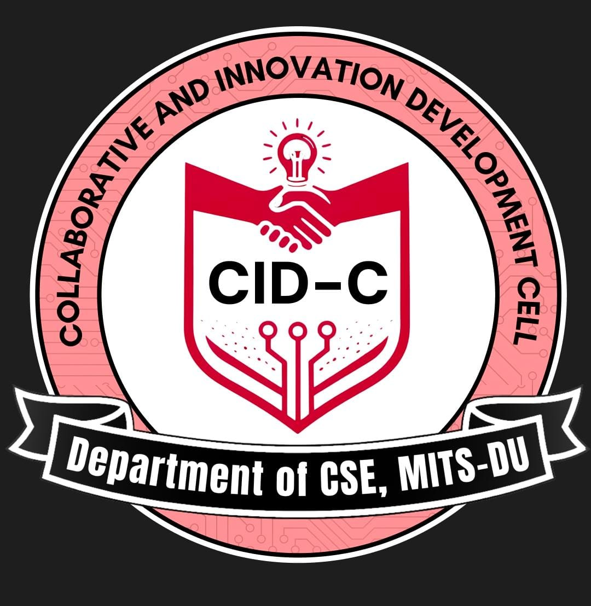

<p align="center">
  
</p>

<h1 align="center">CID-Cell — Collaborative Innovation & Development Cell</h1>

<p align="center">
  A full-stack platform for the <strong>Collaborative Innovation & Development Cell</strong>, Department of Computer Science & Engineering — enabling hands-on learning, real-world project collaboration, mentorship, and innovation-driven growth.
</p>

<p align="center">
  
  
  
  
  
  
</p>

---

## ✨ Features

### 🌐 Public Pages
- **Home** — Hero section, about preview, semester roadmap timeline, key activities, benefits & CTA
- **About** — Vision, mission, and detailed overview of CID-Cell
- **Projects** — Filterable project portfolio (Micro, Macro, Capstone, Open Source) with detail pages
- **Events** — Categorized events with status indicators (Upcoming / Completed) and detail pages
- **Team** — Showcase of CID-Cell members and leadership
- **Roadmap** — Interactive semester-wise learning roadmap
- **Mentors** — Browse and connect with faculty/industry mentors
- **Contact** — Reach out to the CID-Cell team
- **Developers** — Credits page for the development team

### 🔐 Authentication & Onboarding
- **Google OAuth** — Seamless sign-in via Google using `@react-oauth/google`
- **JWT Authentication** — Secure API access with JSON Web Tokens
- **Onboarding Flow** — New users are guided to complete their profile before accessing protected features
- **Role-Based Access** — Four user roles: `student`, `mentor`, `faculty`, `admin`

### 👤 Student Features
- **Dashboard** — Personalized overview with stats, projects, and activity
- **Profile Management** — Edit skills, social links, branch, batch, and bio
- **Submit Projects** — Propose new projects with rich-text descriptions
- **My Projects** — Track owned and contributed projects
- **Join Requests** — Request to join collaborative projects
- **Chat Hub** — Real-time direct messaging with other users
- **Project Chat** — Group chat within project teams
- **Doubt Sessions** — Ask and resolve doubts with mentors
- **Find Mentor** — Discover mentors by domain of expertise
- **Notifications** — Real-time bell notifications for activity updates

### 🎓 Mentor Features
- **Mentor Dashboard** — Overview of mentees, doubt sessions, and assigned projects
- **Mentor Chat** — Direct messaging with students

### 👨‍🏫 Faculty Features
- **Faculty Dashboard** — Overview of events and project mentorship
- **Propose Event** — Submit new event proposals with rich-text descriptions

### ⚙️ Admin Panel
- **Admin Dashboard** — Platform-wide analytics and overview
- **User Management** — View, search, and manage all user accounts
- **Project Management** — Approve, reject, and moderate project submissions
- **Event Management** — Create, edit, and manage events with rich-text editor
- **Member Management** — Manage CID-Cell membership records

### 💬 Real-Time Features (Socket.IO)
- **Direct Messaging** — 1-on-1 real-time chat between users
- **Project Group Chat** — Dedicated chat rooms for project teams
- **Doubt Sessions** — Real-time Q&A between students and mentors
- **Live Notifications** — Instant push notifications for key events

### 🔧 Backend Highlights
- **Auto Inactivity Cleanup** — Contributors inactive for 10 days get warned; removed after 20 days
- **Cloudinary Integration** — Media uploads for avatars and project assets
- **Rate Limiting** — Global + per-route rate limiting for abuse prevention
- **Helmet Security** — HTTP headers hardened with Content Security Policy
- **Email Service** — Transactional emails via Nodemailer
- **Task Management** — Assign and track tasks within projects

---

## 🛠️ Tech Stack

### Frontend

| Technology | Purpose |
|---|---|
| **React 18** | UI library |
| **Vite 6** | Build tool & dev server |
| **React Router 7** | Client-side routing |
| **Tailwind CSS 3.4** | Utility-first styling |
| **Lucide React** | Icon library |
| **Axios** | HTTP client |
| **Socket.IO Client** | Real-time communication |
| **React Quill** | Rich-text editor |
| **@react-oauth/google** | Google OAuth integration |

### Backend

| Technology | Purpose |
|---|---|
| **Express 5** | Web framework |
| **MongoDB + Mongoose 9** | Database & ODM |
| **Socket.IO 4** | Real-time WebSocket server |
| **JWT (jsonwebtoken)** | Authentication tokens |
| **Google Auth Library** | Server-side Google OAuth verification |
| **Cloudinary** | Media storage & CDN |
| **Nodemailer** | Email service |
| **Multer** | File upload handling |
| **Helmet** | Security headers |
| **express-rate-limit** | API rate limiting |
| **Zod** | Input validation |
| **Jest + Supertest** | Testing |

---

## 📁 Project Structure

```
cidcell/
├── frontend/                    # React SPA
│   ├── src/
│   │   ├── components/          # Reusable UI components
│   │   │   ├── Navbar.jsx
│   │   │   ├── Footer.jsx
│   │   │   ├── HeroSection.jsx
│   │   │   ├── Timeline.jsx
│   │   │   ├── ChatInterface.jsx
│   │   │   └── ...
│   │   ├── pages/               # Public & authenticated pages
│   │   │   ├── Home.jsx
│   │   │   ├── Dashboard.jsx
│   │   │   ├── Projects.jsx
│   │   │   ├── Chat.jsx
│   │   │   ├── FindMentor.jsx
│   │   │   └── ...
│   │   ├── admin/               # Admin panel
│   │   │   └── pages/
│   │   │       ├── AdminDashboard.jsx
│   │   │       ├── UserManagement.jsx
│   │   │       ├── ProjectManagement.jsx
│   │   │       ├── EventManagement.jsx
│   │   │       └── MemberManagement.jsx
│   │   ├── faculty/             # Faculty dashboard & event proposal
│   │   ├── mentor/              # Mentor dashboard & chat
│   │   ├── student/             # Student-specific features
│   │   ├── context/             # React context (AuthContext)
│   │   ├── constants/           # App-wide constants
│   │   ├── utils/               # Utility functions
│   │   └── App.jsx              # Root component with routing
│   ├── package.json
│   ├── tailwind.config.cjs
│   └── vite.config.js
│
├── backend/                     # Express API server
│   ├── config/
│   │   ├── db.js                # MongoDB connection
│   │   └── cloudinaryConfig.js  # Cloudinary setup
│   ├── controllers/             # Route handlers
│   │   ├── authController.js
│   │   ├── projectController.js (via routes)
│   │   └── eventController.js
│   ├── models/                  # Mongoose schemas
│   │   ├── User.js
│   │   ├── Project.js
│   │   ├── Event.js
│   │   ├── Task.js
│   │   ├── Message.js
│   │   ├── Notification.js
│   │   ├── JoinRequest.js
│   │   ├── DoubtSession.js
│   │   └── ...
│   ├── routes/                  # API route definitions
│   │   ├── authRoutes.js
│   │   ├── projectRoutes.js
│   │   ├── eventRoutes.js
│   │   ├── chatHubRoutes.js
│   │   ├── doubtRoutes.js
│   │   └── ...
│   ├── middleware/              # Auth, rate limiting, error handling
│   ├── socket/                  # Socket.IO event handlers
│   ├── utils/                   # Email service, helpers
│   ├── tests/                   # Jest test suites
│   ├── server.js                # App entry point
│   └── package.json
│
└── README.md
```

---

## 🚀 Getting Started

### Prerequisites

- **Node.js** ≥ 18
- **npm** ≥ 9
- **MongoDB** (local or [MongoDB Atlas](https://www.mongodb.com/atlas))

### 1. Clone the Repository

```bash
git clone https://github.com/KD2303/cidcell.git
cd cidcell
```

### 2. Backend Setup

```bash
cd backend
npm install
```

Create a `.env` file in the `backend/` directory:

```env
NODE_ENV=development
PORT=5000
MONGO_URI=mongodb://localhost:27017/mern_db2
JWT_SECRET=your_jwt_secret_here
GOOGLE_CLIENT_ID=your_google_client_id
GOOGLE_CLIENT_SECRET=your_google_client_secret
CLOUDINARY_URL=cloudinary://your_cloudinary_url
```

Start the backend server:

```bash
npm start        # Production
npm run dev      # Development (with nodemon)
```

### 3. Frontend Setup

```bash
cd frontend
npm install
```

Start the frontend dev server:

```bash
npm run dev
```

The app will be available at `http://localhost:5173` (or the next available port).

### 4. Build for Production

```bash
cd frontend
npm run build     # Create optimized production build
npm run preview   # Preview production build locally
```

---

## 🔑 API Routes

| Prefix | Description |
|---|---|
| `/api/auth` | Google OAuth login, token verification |
| `/api/users` | User profile CRUD |
| `/api/projects` | Project CRUD, contributors, status |
| `/api/events` | Event CRUD, registration |
| `/api/members` | CID-Cell membership management |
| `/api/tasks` | Task assignment and tracking |
| `/api/messages` | Direct messaging |
| `/api/project-messages` | Project group chat messages |
| `/api/chat` | Chat hub (conversation list, history) |
| `/api/doubts` | Doubt sessions between students & mentors |
| `/api/join-requests` | Project join request workflow |
| `/api/notifications` | User notifications |
| `/api/upload` | File/image uploads via Cloudinary |

---

## 🧪 Testing

```bash
cd backend
npm test         # Runs Jest test suites
```

---

## 🚢 Deployment

- **Frontend** — Deployed on [Vercel](https://vercel.com) → [cidcell.vercel.app](https://cidcell.vercel.app)
- **Backend** — Can be deployed on Render, Railway, or any Node.js hosting
- **Database** — MongoDB Atlas recommended for production

---

## 📜 Scripts

### Frontend

| Command | Description |
|---|---|
| `npm run dev` | Start Vite dev server with HMR |
| `npm run build` | Build for production |
| `npm run preview` | Preview production build locally |

### Backend

| Command | Description |
|---|---|
| `npm start` | Start the server |
| `npm run dev` | Start with nodemon (auto-reload) |
| `npm test` | Run Jest test suites |

---

## 🤝 Contributing

1. Fork the repository
2. Create a feature branch (`git checkout -b feature/your-feature`)
3. Commit your changes (`git commit -m "Add your feature"`)
4. Push to the branch (`git push origin feature/your-feature`)
5. Open a Pull Request

---

## 📄 License

This project is private and maintained by the **CID-Cell team**, Department of CSE.

---

<p align="center">
  Built with ❤️ by <strong>CID-Cell</strong> — CSE Department
</p>
